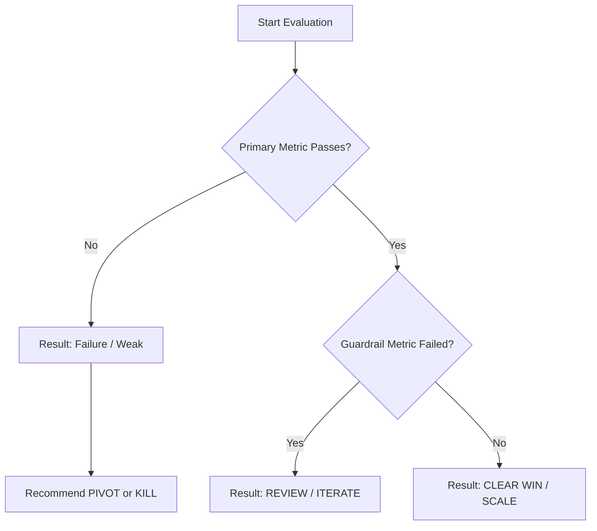

# Decision Rules Specification

Rules mapping experiment results and metrics to decision recommendations.

## Deterministic Rule Flow

The recommendation engine evaluates thresholds in this order:

## Rules Mapping Table

| Metric Condition | Guardrail Condition | Sample Size / Confidence | Recommendation | Reason |
| :--- | :--- | :--- | :--- | :--- |
| $\ge$ Success Threshold | All Guardrails Passed | Sufficient / High | **SCALE** | Exceeded success threshold safely with statistical or strong operational signal. |
| $\ge$ Success Threshold | 1 or more Guardrails Failed | Any | **REVIEW / ITERATE** | Primary metric won but triggered guardrail violation (e.g. spam complaints). Requires adjustment. |
| Neutral (Between Success & Failure) | All Guardrails Passed | Sufficient | **ITERATE** | Positive trend but did not meet full scale target. Tweak variables. |
| Neutral (Between Success & Failure) | Any | Insufficient | **CONTINUE** | Promising trend but needs larger sample size to cross operational thresholds. |
| < Failure Threshold | Any | Any | **KILL** | Underperformed baseline or dropped below critical failure threshold. |
| Severe Failure Threshold | Any | Any | **KILL** | Immediate stop required. |

## Guardrail Safeguard Rule
If a primary metric achieves a "WIN" status but any guardrail metric breaches its threshold (e.g., unsubscribe rate $> 2\%$), the engine **MUST NOT** recommend **SCALE**. It must force a status of **REVIEW** or **ITERATE** and flag the guardrail violation clearly in the final recommendation payload.
