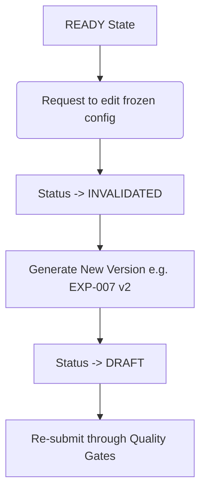

# Experiment Versioning

To ensure scientific integrity, all experiment setups must be versioned and immutable once finalized.

## Immutable Fields at `READY`
When an experiment transitions to `READY`, the following attributes are frozen:
- `hypothesis`
- `primary_metric`
- `success_threshold`
- `failure_threshold`
- `target_audience`
- `experiment_design` (Control/Variant definition)

## Edit Flow

If modifications are required on frozen fields, the model must execute the versioning workflow:

## Schema References
- All iterations are tracked in `schemas/experiment-version.json`.
- The parent experiment ID remains the same, but the `version` increment (v1 -> v2) ensures audit trail integrity.
