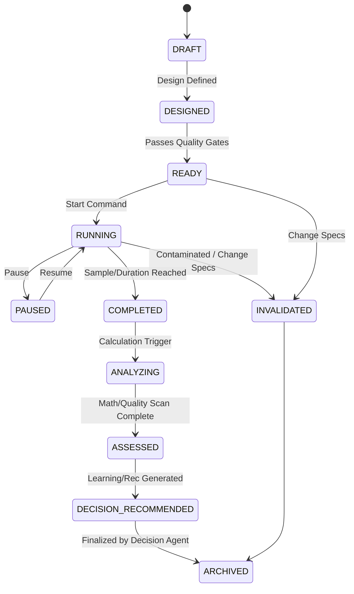

# Experiment State Machine

This file details the states and valid transitions of GTMOS experiments.

## State Taxonomy

### Experiment Lifecycle States
- **DRAFT**: Initial suggestion state. Hypothesis may be unstructured.
- **DESIGNED**: Complete variables, metrics, control/variant target defined.
- **READY**: Quality gates passed, baseline established, **properties frozen**.
- **RUNNING**: Actively collecting data. State updates saved to `experiment-state.json`.
- **PAUSED**: Temporarily halted. Tracking paused.
- **INVALIDATED**: Compromised during run, or specification was altered while READY/RUNNING.
- **COMPLETED**: Data collection completed. No new observations accepted.
- **ANALYZING**: Deterministic calculations underway.
- **ASSESSED**: Statistical versus operational signals evaluated, quality scanned.
- **DECISION_RECOMMENDED**: Final recommendation object emitted.
- **ARCHIVED**: State archived into historical experiment memory.

## Decision Recommendations
Separated from execution lifecycle:
- **SCALE**: High performance win. Increase cohort size/exposure.
- **ITERATE**: Moderate outcome. Adjust secondary variables, re-test.
- **PIVOT**: Low performance or failed hypothesis but new insight found. Change tactic.
- **CONTINUE**: Promising but sample size too small for confidence (used when decision agent evaluates mid-run).
- **HOLD**: Suspend strategic scaling (e.g. wait for resource allocation).
- **KILL**: Underperformed baseline, high guardrail degradation, or invalid execution. Stop immediately.
